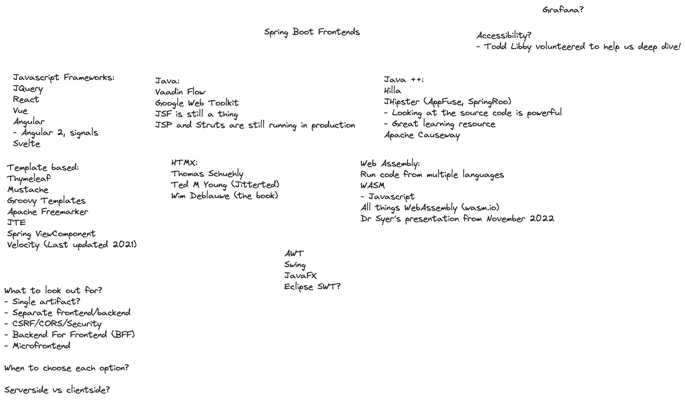

# Resources Learning Spring Frontends

A list of resources for building frontends for your Java & Spring Applications. This started as a discussion on an
episode of The Spring Office Hours Podcast that you can find below. 

[S3E14 - Spring Boot Frontends](https://spring-office-hours.transistor.fm/episodes/s3e14-spring-boot-frontends)

This is the collection of resources we put together during the show and you can find links for everything below. 

## Resources 

- Web Development
    - [HTML](https://developer.mozilla.org/en-US/docs/Web/HTML)
    - [CSS](https://developer.mozilla.org/en-US/docs/Web/CSS)
    - [JavaScript](https://developer.mozilla.org/en-US/docs/Web/JavaScript)
- JavaScripts Frameworks
    - [React](https://react.dev/)
    - [Vue](https://vuejs.org/)
    - [Angular](https://angular.io/)
    - [Svelte](https://svelte.dev/)
- Java
    - [Vaadin](https://vaadin.com/)
    - [Jakarta Faces](https://github.com/jakartaee/faces) (Java Server Faces)
    - Full Stack Frameworks
        - [Hilla](https://hilla.dev/)
        - [JHipster](https://www.jhipster.tech/)
- Spring Template languages
    - [Thymeleaf](https://www.thymeleaf.org/)
    - [Mustache](https://mustache.github.io/)
    - [Groovy](https://docs.spring.io/spring-framework/reference/web/webmvc-view/mvc-groovymarkup.html)
    - [Freemarker](https://freemarker.apache.org/index.html)
    - [jte](https://jte.gg/)
- [HTMX](https://htmx.org/)
    - [Spring View Component](https://github.com/tschuehly/spring-view-component)
    - [Spring Boot and Thymeleaf library for htmx](https://github.com/wimdeblauwe/htmx-spring-boot)
- Web Assembly (WASM)
    - [Web Assembly](https://github.com/wimdeblauwe/htmx-spring-boot)
    - [Spring WASM Demo](https://github.com/dsyer/spring-wasm-demo)

## Contributing

If you would like to contribute to this repository please feel free to send us a PR.